# Model creator

Model creator jest narzędziem, które umożliwia poznanie podstawowych własciwości posiadanych danych oraz budowę kilku modelu klasycznego modelu uczenia maszynowego.

## Budowa aplikacji

Aplikacja składa się z trzech zakładek:
- Add data: pozwala zaimportować do aplikacji dane, które następnie są zapisywane w wygodnej dla niej lokalizacji
- Your data: pozwala sprawdzić podstawowe informacje o danych oraz zależności pomiędzy zmiennymi
- Train model: pozwala wytrenować wybrany model

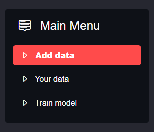

### Add data
Zakładka *Add data* wykorzystanie wybranych danych podczas korzystania z aplikacji. 
Wystarczy użyć przcisku **Browse files** a następnie wybrać plik z rozszerzeniem csv oraz kliknąć przysić **Upload**.

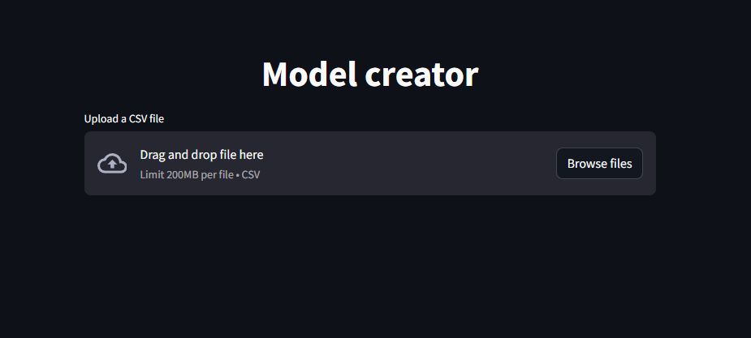

Gdy wszystko przebiegnie pomyślnie powinno wyglądać tak jak na zdjęciu poniżej.

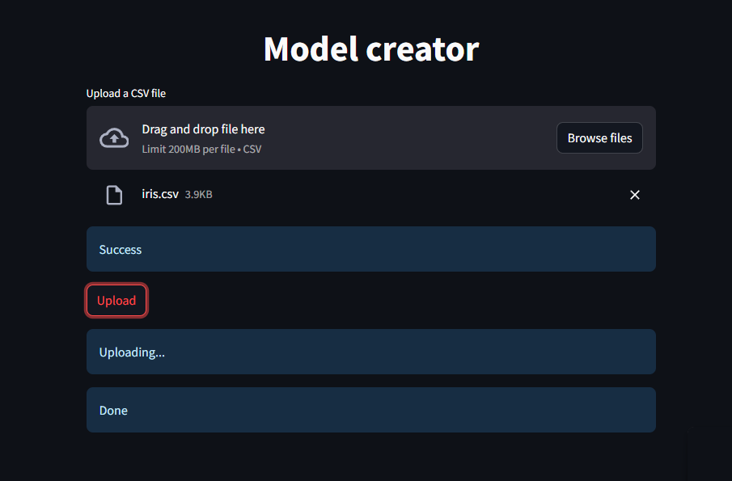

### Your data

Zakładka *Your data* podzielona jest na 5 kart.

#### Variable types

Mamy możliwość ujżenia dostępnych zmiennych oraz sprawdzenia ich typów.

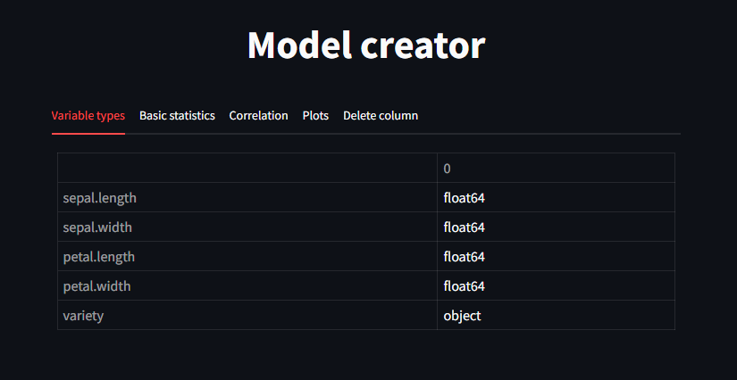

#### Basic statistics

Dzięki tej karcie poznajemy podstawowe statystyki każdej ze zmiennych numerycznych.

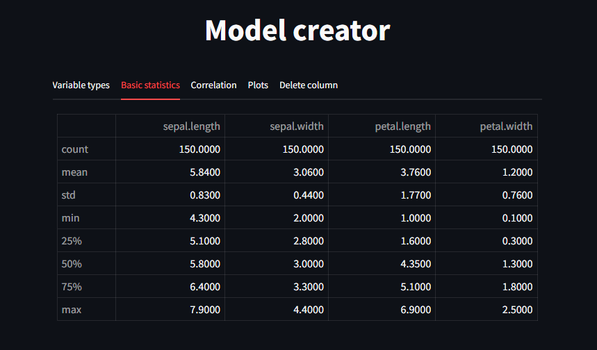

#### Correlation 

Poznajemy zależności pomiędzy zmiennymi.

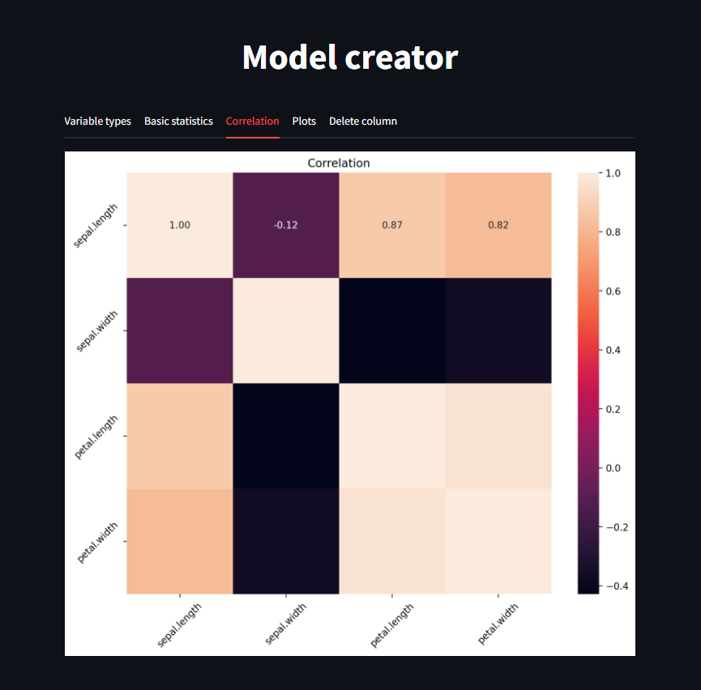

#### Plots

Wybieramy zmienne na podstawie których otrzymujemy wykres. W zależności od tego ile zmiennych wybierzemy oraz jakiego typu będą otrzymamy inny wykres.

##### Jedna zmienna

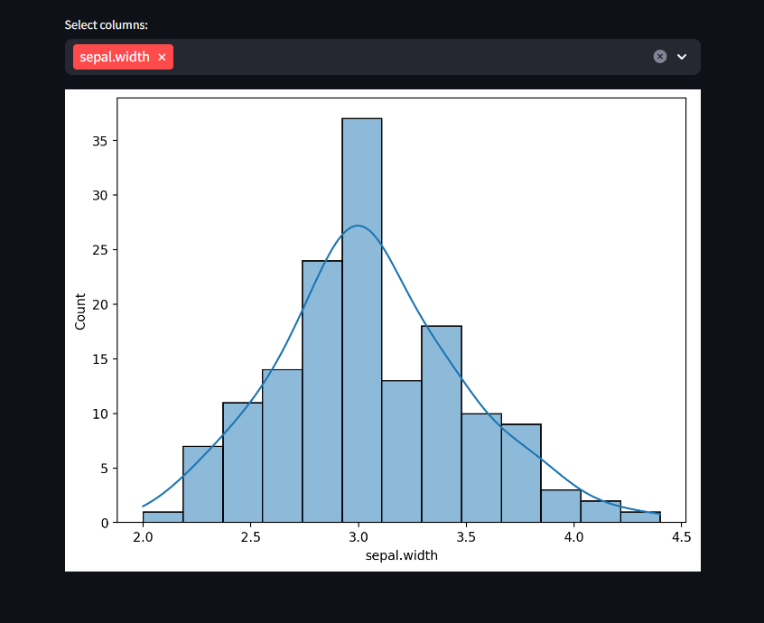

##### Dwie zmienne - numeryczne

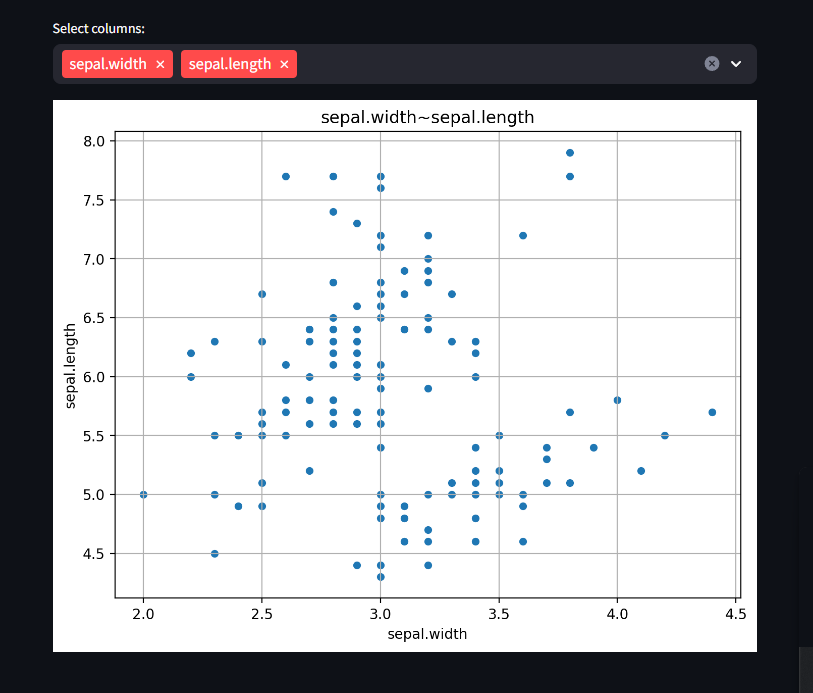

##### Dwie zmienne - różne

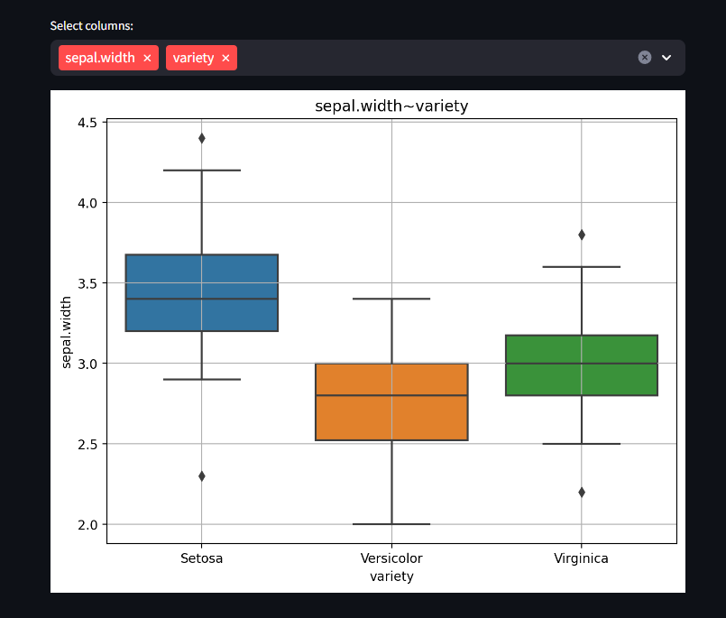

##### Dwie zmienne - kategoryczne

Otrzymujemy tabelę z liczebnością każdej z kombinacji.

##### Trzy lub więcej

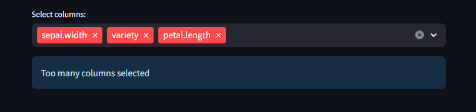

#### Delete column

Mamy możliwość usunięcia kolumny z ramki danych.

### Train model

Zakładka podzielona jest na 3 karty.

#### Compare entry-level models

Mamy możliwość zbudowania wybranych podstawowych modeli. Do wyboru mamy 4 modele:
- Drzewo decyzyjne
- Las losowy
- KNN
- SVM

Wybieramy modele do zbudowania, zmienną którą chcemy przewidywać oraz część zbioru która posłuży do oceny modelu.

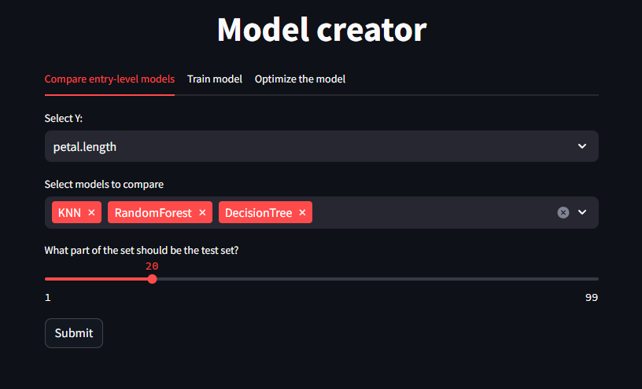

Po użyciu przyciusku **Submit** modele się trenują a my otrzymujemy porównanie uzyskanych modeli oraz czas trwania operacji. 

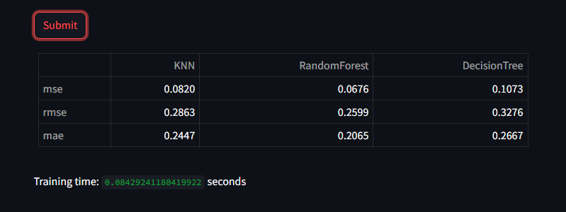

W zależności od typu zmiennej zależnej otrzymujemy różny zestaw miar dopasowania.
Numeryczna:
- MSE
- RMSE
- MAE

Kategoryczna:
- Accuracy
- Sensitivity
- Specificity

#### Train your model

Mamy mozliwość wytrenowania wybranego modelu na własnych zasadach. Tak jak poprezednio wybieramy model, zmienną zależną oraz część zbioru testowego. Po wyborze modelu dostajemy zestaw parametrów które możemy dostrajać według właśnych życzeń. Po zatwierdzeniu wyboru przyciskiem **Submit** dostajemy miery dopasowania dla wybranego zestawu.

Tak jak poprzednio dla różnych typów są różne zestawy mier dopasowania.

#### Optimize the model

Mamy możliwość wytrenowania modelu wykorzystując optymalizację hiperparametrów. Ponownie wybieramy model, zmienną zależną oraz część zbioru testowego. Po potwierdzeniu wyboru oraz odczekaniu chwili otrzymujemy:
- Zestaw najlepszych parametórw
- Zestaw miar dopasowania
- Czas przeszukiwania oraz uczenia modelu

## Wymagania
- python: 3.11.7
- pandas: 1.5.3
- numpy: 1.24.4
- streamlit: 1.33.0
- streamlit_option_menu: 0.3.12
- matplotlib: 3.8.0
- seaborn: 0.12.2
- scikit-learn: 1.2.2

